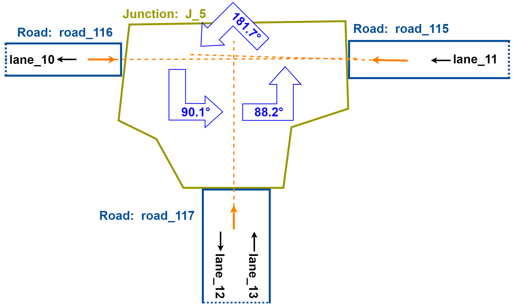

# Map parsing

Map parsing includes many steps, and here we focus on the method of road structure classification here.

## Road structure classification

> Note: The "road structure" and "related roads" words used here are intended to explain the overall idea of the algorithm, with ignoring unimportant details. 
> They can be mapped roughly to the code as follows:
> 
> road structure *(in this description)* = junction *(in the code)*  
> related roads *(in this description)* = connectors *(in the code)*

### Classification using checks of classes

The classification is roughly a prioritized checking process.

Each class has a check, a road structure tries all the checks in a fixed order.
Finally, the road structure belongs to the owner of the first passed check.

### Factors of class checking

The factors of class checking is as follows:
* Number of related roads.
* Angles between related roads.
* Other factors required by customized limits .

Based on the factors, the classes checking standards is as follows:

| Checking order | Class Name         | Number of related roads | Adjacent roads angle range sequence (Unit: degree)  | Extra       |
| -------------- | ------------------ | ----------------------- | --------------------------------------------------- | ----------- |
| 1              | JCrossroads        | 4                       | [45, 135], [45, 135], [45, 135], [45, 135]          |             |
| 2              | JYShaped           | 3                       | [90, 150], [90, 150], [90, 150]                     |             |
| 3              | JTShaped           | 3                       | [45, 135], [150, 210], [45, 135]                    |             |
| 4              | J2EndsLongStraight | 2                       | [150, 210]                                          | length > 40 |
| 5              | J2EndsLong         | 2                       | Any                                                 | length > 40 |
| 6              | J2EndsStraight     | 2                       | [150, 120]                                          |             |
| 7              | J3ends             | 3                       | Any                                                 |             |
| 8              | J4ends             | 4                       | Any                                                 |             |
| 9              | J2ends             | 2                       | Any                                                 |             |
| 10             | JunctionClass      | Any                     | Any                                                 |             |

### Steps of class checking

The steps of class checking is as follows, we use the `J_5` junction in map `gomentum` checking `JTShaped` as an example to demonstrate (Showed in the figure below).

1. **Check the number of related roads.**
  * There are three related roads: `road_115`, `road_116` and `road_117`, match the number requirement of `JTShaped`.
2. **Calculate angles between every two related roads.**
  * There are six angles for related angles in the example, three of them are marked in the figure, the other three are their reverse angles.
    So these six angles are `181.7`, `88.2`, `90.1`, `-181.7`, `-88.2`, `-90.1` in degrees.
3. **Try all the permutations of related roads to match adjacent roads angle range sequence.**
  * There are six permutations in the example, they are listed in the following sheet.
    
    | Road 1   | Road 2   | Road 3   | Angle 1 to 2 | Angle 2 to 3 | Angle 3 to 1 | Fit or not |
    | -------- | -------- | -------- | ------------ | ------------ | ------------ | ---------- |
    | road_115 | road_116 | road_117 | 181.7°       | 90.1°        | 88.2°        | No         |
    | road_115 | road_117 | road_116 | -88.2°       | -90.1°       | -181.7°      | No         |
    | road_116 | road_115 | road_117 | -181.7°      | -88.2°       | -90.1°       | No         |
    | road_116 | road_117 | road_115 | 90.1°        | 88.2°        | 181.7°       | No         |
    | road_117 | road_115 | road_116 | 88.2°        | 181.7°       | 90.1°        | Yes        |
    | road_117 | road_116 | road_115 | -90.1°       | -181.7°      | 88.2°        | No         |
    
    The fifth permutation match the angle range sequence, therefore the road structure `J_5` passes the check in this step.
4. **Execute customized check.**
  * There are not any checks in the example, and for other classes, corresponding checks are executed here.
    

### Direction definitions

Two kinds of directions are used to calculate the angle between roads. They are intermediate variables for a road structure, and related to the road structure.

#### Direction of lane

Each lane has a central curve, which is stored as point sequence in the Apollo map files.
We regard the end connected to the road structure as the "close" end.
Therefore, we can give points the concept of close and far by their order in the sequence.

We define the direction from the second close point to the closest point on the central curve as the direction of the lane.

#### Direction of road

We calculate the sum of direction vectors of all the lanes belong to a road.
We present the directions of all lanes belong to the road as direction vectors, and sum them up.
The direction of the sum is defined as the direction of the road.
